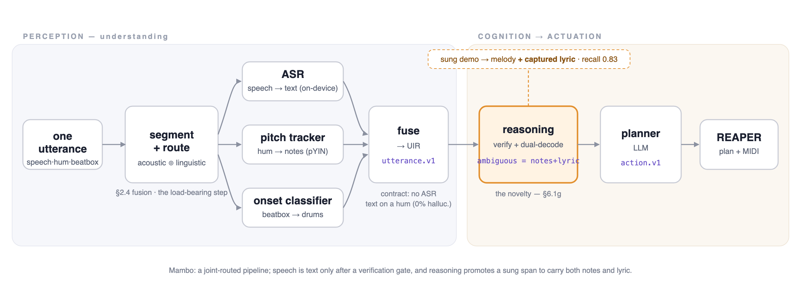

# Mambo — a voice + hum producer co-pilot

**Talk to your DAW the way you'd talk to a producer** — spoken instructions and hummed
melody, *in a single breath* — and Mambo figures out which part was a command and which
was music, then does it.

> *"Give me something like ♪ hmm-hmm-hmmm ♪ but slower… and kick the drums up a bit."*

Mambo parses that one utterance into a structured intent, extracts the hummed notes,
and drives a DAW (REAPER today). It runs on off-the-shelf parts at **≈zero training
cost**, and — unlike a transcriber — it **never hallucinates words onto your hum**.

📄 **Paper:** [PAPER.md](PAPER.md)



*One utterance is segmented and routed (acoustic ⊕ linguistic), each span decoded by a specialist, fused into a structured representation where **no ASR text may survive on a hum**, then a reasoning layer (verify + dual-decode) and an LLM planner drive REAPER.*

---

## Why this is new

| System | command + hum **in one utterance** | pitch → notes | spoken instructions | DAW control | no ASR-on-hum hallucination |
|---|:--:|:--:|:--:|:--:|:--:|
| Whisper / Siri | ✗ | ✗ | ✓ | ✗ | ✗ (hallucinates words on non-speech) |
| Vochlea Dubler, imitone | ✗ | ✓ | ✗ | ◑ | n/a |
| Audio-LLMs (Qwen2-Audio, Gemini) | ◑ | ✗ (can't reliably hear pitch) | ✓ | ✗ | ✗ |
| DAWZY (2025) | ✗ (hum = a mode-switch button) | ✓ | ✓ | ✓ | ✗ |
| **Mambo (this repo)** | **✓** | **✓** | **✓** | **✓** | **✓ (0%)** |

Mambo is the only system that does all of it in one breath. We name the underlying task
**Mixed Vocal Utterance Parsing** and ship a benchmark + baselines for it.

## How it works (segment-and-route)

```
mic → joint acoustic⊕linguistic router → { speech → ASR ,  melody → pitch tracker }
        → mambo.utterance.v1 (the UIR)  → LLM planner → mambo.action.v1 + MIDI → REAPER
```

The load-bearing idea: **reasoning decides *structure*, a pitch tracker handles *pitch*.**
The router fuses bottom-up acoustics (voicing, f0-stability) with the top-down sentence
frame (*"something like ___"* brackets a demonstration). A structural rule — **a verified
melody span may never carry ASR text** — is enforced in the schema, which is what gives 0%
hallucination on hums. No LLM is used to *hear* pitch (it can't, reliably — see §3.1).

## Results (every number traces to a committed `runs/` entry)

| | result |
|---|---|
| **Router** (joint vs arms, 8-seed CIs) | segment F1 **0.92** clean / **0.91** @10 dB; joint *ties* language-only on clean, **significantly wins under noise** (paired p=0.008); hallucination is **negligible across all routed arms** (≤0.3%) — vs the *transcribe-everything* baseline's **70%** |
| **Baselines** (B-table, full set) | whisper-only collapses (70% hallucination, note F1 0.19) → joint routing fixes both |
| **Can an audio-LLM hear pitch on our task?** (B6) | a *frontier* omni model (`gpt-audio-1.5`) gets the note count right but reconstructs hums at only **F1 ≈ 0.48** — and *inconsistently* (0.42–0.52 across 4 runs); the specialized tracker reconstructs them exactly and stably. An open 7B (Qwen2-Audio) scores lower mostly by **under-generating** notes, not mis-pitching — separated by the honest metric (§6.1c) |
| **Planner** (R1, 50-utterance suite) | **0.88** on a free hosted LLM; **0.86** on a *free, fully-offline local* model |
| **Generalization** (N=4 real voices) | containment generalizes (**1.00** on all 4); per-voice **voiceprint** calibration recovers the wide-vibrato outlier (Rim note-count 0.12→0.31, zero regression on normal voices); a **semantic-verify** pass fixes false-melody-on-speech (0.12→0.75) |

Honest limitations are in [PAPER.md §6.2](PAPER.md) — read them; the synthetic gates are
near-ceiling by construction and the real-voice eval is small-n (N=4).

## Quickstart

Needs Python 3.11/3.12 (installed for you by [`uv`](https://docs.astral.sh/uv/)).

```bash
cd lab && uv sync --extra asr     # core + the faster-whisper ASR probe; uv fetches Python
cd .. && make gate-R0             # reproduce the perception/router numbers
make uir  FILE=x.wav              # any WAV → mambo.utterance.v1 (the structured parse)
make demo FILE=x.wav              # WAV → action plan + rendered .mid
make studio                       # the live cockpit at http://localhost:8765 — tap the mic
make reaper-demo                  # the action plan, live in REAPER (see gb-bridge/reaper/)
```

Pitch tracking uses core `librosa.pyin`, so the only heavy extra the live pipeline
needs is `asr`. See [GETTING_STARTED.md](GETTING_STARTED.md) for the full app + REAPER
walkthrough.

### Configuration (API keys are optional)

**Mambo runs fully offline with zero keys.** Keys only upgrade individual stages —
`cp .env.example .env` and fill in any you want:

| Key | Unlocks | Without it |
|---|---|---|
| `OPENROUTER_API_KEY` | hosted LLM planner (free tier) | local/offline planner (0.86 vs 0.88) |
| `OPENAI_API_KEY` | reasoning layer (semantic-verify, sung-lyric dual-decode) | rules-only fallback |
| `ELEVENLABS_API_KEY` | richer TTS speech fixtures + optional STT | offline macOS `say` |
| `MODAL_TOKEN_ID/SECRET` | the R3 LoRA training track only | not needed to run Mambo |

### Platforms

- **macOS (Apple Silicon)** — primary; developed and tested here, everything works.
- **Linux** — the library, `make uir`/`demo` on your own WAV, and `make studio` work.
  Note: `make gate-R0` regenerates speech fixtures with macOS `say`, so on Linux set
  `ELEVENLABS_API_KEY` and use `make fixtures-eleven` first (the melody fixtures are
  pure DSP and regenerate anywhere).
- **Windows** — REAPER runs, but the bridge/Studio setup is documented for macOS and
  is untested on Windows.

**Mambo Studio** (`make studio`) is the interactive app: tap the mic, speak a command
and/or hum a melody, and it shows what it heard and what it told REAPER to do. It has
**projects** (per-project notebook / takes / REAPER doc), a **provider chooser** (run the
planner on a free local model or any hosted one, keys saved locally), and a 20-second
**"tune to your voice"** calibration. To see commands applied live, run REAPER with
`gb-bridge/reaper/mambo_bridge.lua`.

## Contributing

Two ways to help, detailed in [CONTRIBUTING.md](CONTRIBUTING.md):

- **Contribute a voice (no coding).** Generalization needs diverse voices. The collector
  (`tools/voice_collect/`) is a single self-contained HTML page — open it, record ~30
  short prompts in your browser (nothing uploads), and it builds one `.zip` to send back.
  Deliberately diverse voices (gender, f0 range, musician/non-musician) are the single
  highest-value contribution.
- **Contribute code.** `cd lab && uv sync --extra asr && uv run pytest`, then see the two
  project rules (the schema contract; a feature isn't done without a gate) in CONTRIBUTING.

Please also read the [Code of Conduct](CODE_OF_CONDUCT.md) and, for anything involving
keys or recordings, the [security & privacy policy](SECURITY.md).

## Repo map

| Path | What |
|---|---|
| `lab/mambo_lab/` | the Stage-R core — `ir.py` (the UIR contract), `router.py`, `melody.py`, `planner.py`, `semantic_verify.py`, `studio.py`, `eval/` |
| `datagen/` | synthetic fixture generation (bit-exact from a seed) |
| `gb-bridge/reaper/` | the REAPER Lua bridge (the actuation layer) |
| `fixtures/`, `runs/` | committed ground truth · per-experiment provenance (config, commit, seed, results) |
| `PAPER.md` | the full paper (design rationale, methods, results) |

## Cite

```bibtex
@software{karaca2026mambo,
  author = {Karaca, Ufuk},
  title  = {Mambo: Mixed Vocal Utterance Parsing for a DAW Producer Co-Pilot},
  year   = {2026},
  url    = {https://github.com/ufukkaraca/large-mambo-model}
}
```

## License & transparency

MIT (see [LICENSE](LICENSE)). Study volunteers' raw audio is **not** included (only derived
metrics); the optional training track references datasets/weights with their own terms.

*Built largely with an autonomous coding agent (Claude Opus 4.8) under human direction; every
reported number is produced by committed code on committed data and is independently
reproducible (PAPER.md §7.1).*
